# 🍰 Sweetie House – My Business Web

เว็บไซต์ธุรกิจร้านขนม Sweetie House สำหรับแสดงข้อมูลร้าน บริการ ทีมงาน และช่องทางการติดต่อ  
พัฒนาเพื่อเป็นตัวอย่างโครงสร้างเว็บธุรกิจแบบง่าย เหมาะสำหรับผู้เริ่มต้นทำโปรเจกต์ HTML/CSS

---

## 📁 โครงสร้างไฟล์ (File Structure)

my-business-web/
├── index.html
├── about.html
├── services.html
├── contact.html
├── README.md
│
├── css/
│ └── styles.css
│
├── images/
│ ├── home/
│ │ ├── home.png
│ │ └── home2.png
│ │
│ ├── about/
│ │ ├── about1.png
│ │ ├── about2.png
│ │ └── about3.png
│ │
│ ├── contact/
│ │ ├── Contact1.png
│ │ ├── Contact2.png
│ │ ├── Contact3.png
│ │ └── Contact4.png
│ │
│ ├── services/
│ │ ├── menu1.png
│ │ ├── menu2.png
│ │ ├── menu3.png
│ │ ├── cake.png
│ │ ├── drink.png
│ │ └── gift.png
│ │
│ ├── team/
│ │ ├── team1.png
│ │ ├── team2.png
│ │ └── team3.png
│ │
│ └── logo/
│ └── logo1.png

---

## 🖼 รูปหน้าจอทั้งหมด (Screenshots)

> _เพิ่มภาพหน้าจอของแต่ละหน้าเว็บไซต์ที่นี่_

### ⭐ หน้า Home (index.html)

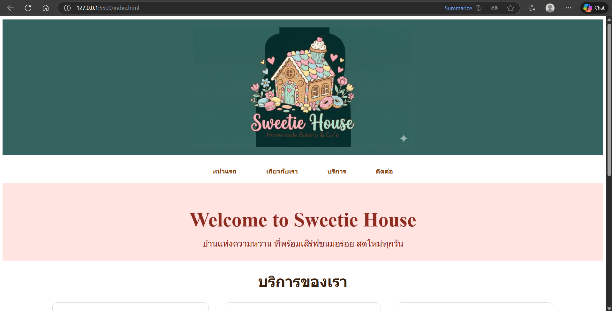

### ⭐ หน้า About (about.html)

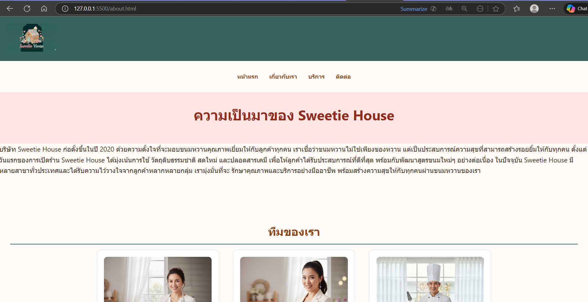
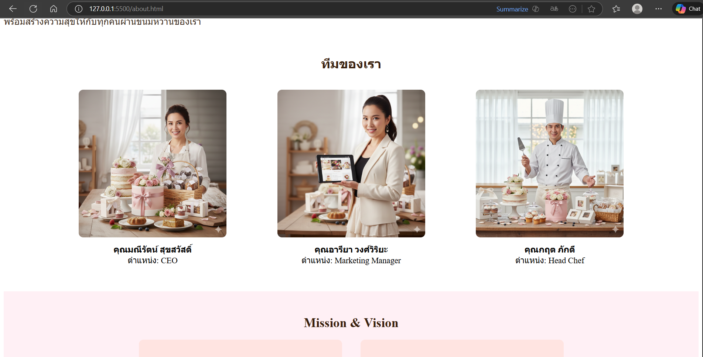
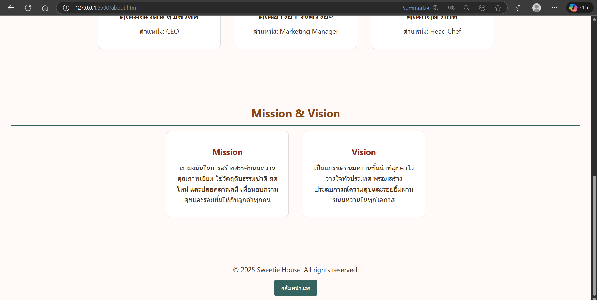

### ⭐ หน้า Services (services.html)

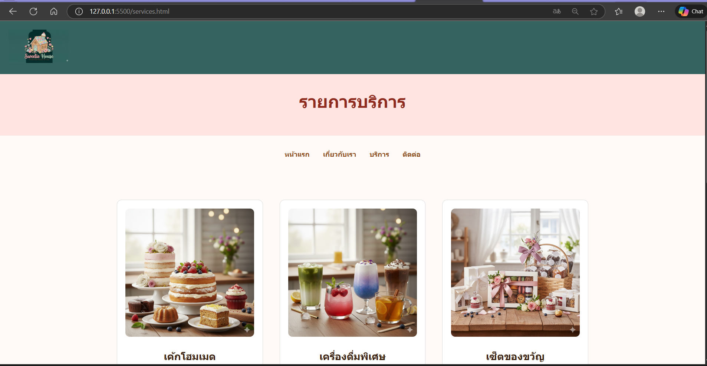
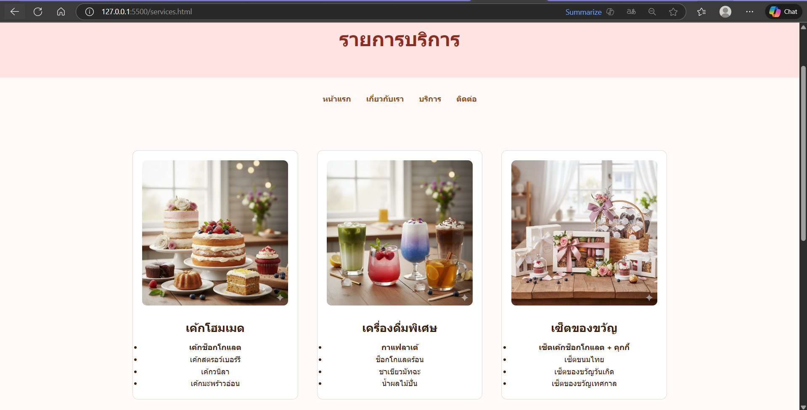
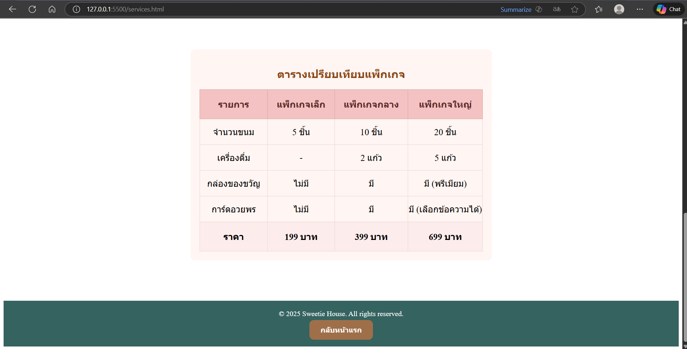

### ⭐ หน้า Contact (contact.html)

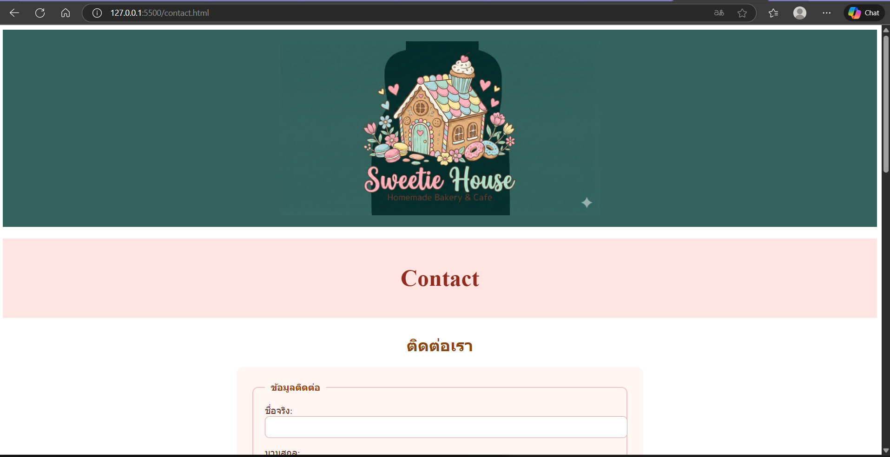
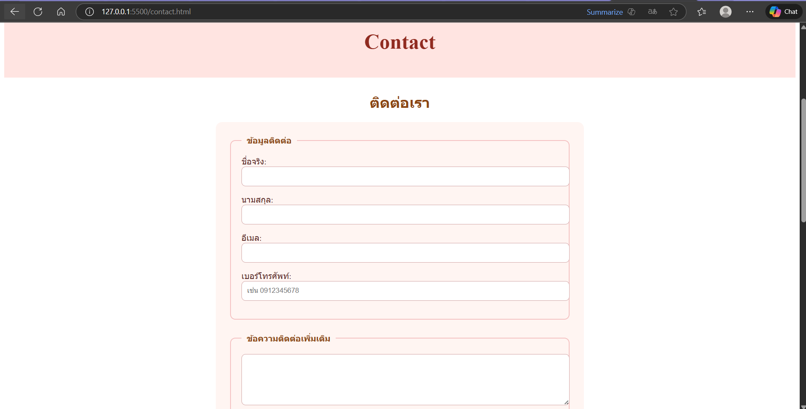
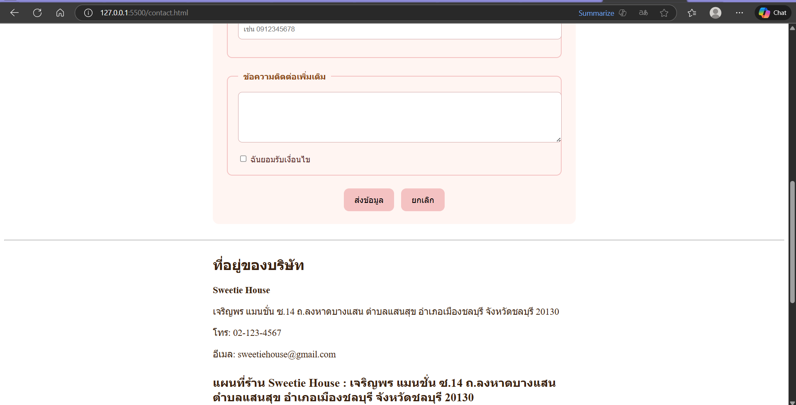
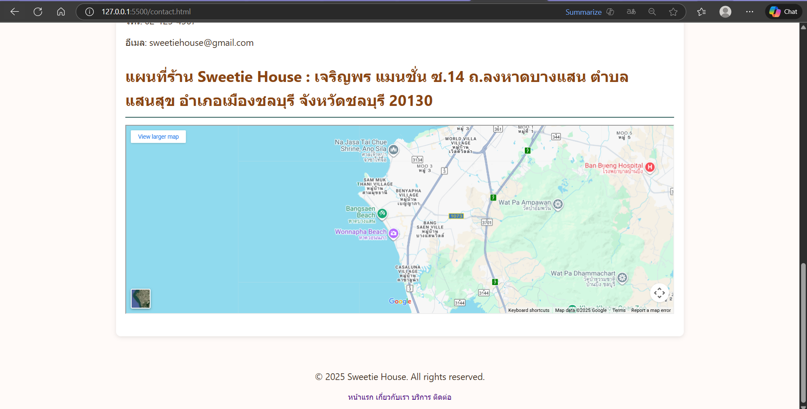

---

## 🔗 ลิงก์เข้าสู่แต่ละหน้า (Navigation Links)

- **[หน้าแรก – index.html](index.html)**
  แสดงภาพรวมของร้าน Sweetie House เช่น แบนเนอร์ เมนูยอดนิยม และโปรโมชั่น

- **[เกี่ยวกับเรา – about.html](about.html)**
  อธิบายประวัติของร้าน แนวคิด ภาพรวมธุรกิจ และสมาชิกทีมงาน

- **[บริการ – services.html](services.html)**
  รายการบริการทั้งหมด เช่น เค้ก เครื่องดื่ม ของขวัญ พร้อมรูปและคำอธิบายบริการ

- **[ติดต่อเรา – contact.html](contact.html)**
  ฟอร์มติดต่อ ข้อมูลที่อยู่ เบอร์โทร อีเมล และแผนที่ Google Maps
