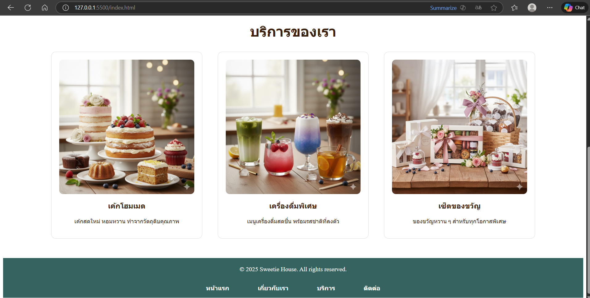

# 🍰 Sweetie House – My Business Web

เว็บไซต์ธุรกิจร้านขนม Sweetie House สำหรับแสดงข้อมูลร้าน บริการ ทีมงาน และช่องทางการติดต่อ  
พัฒนาเพื่อเป็นตัวอย่างโครงสร้างเว็บธุรกิจแบบง่าย เหมาะสำหรับผู้เริ่มต้นทำโปรเจกต์ HTML/CSS

---

## 📁 โครงสร้างไฟล์ (File Structure)

```
my-business-web/
├── index.html
├── about.html
├── services.html
├── contact.html
├── images/
│ ├── logo1.png
│ ├── cake.png
│ ├── drink.png
│ ├── gift.png
│ ├── team1.png
│ ├── team2.png
│ ├── team3.png
│ └── ...
└── README.md

---

## 🖼 รูปหน้าจอทั้งหมด (Screenshots)

> _เพิ่มภาพหน้าจอของแต่ละหน้าเว็บไซต์ที่นี่_

- หน้า Home (index.html)
  
  

- หน้า About (about.html)
  
  
  

- หน้า Services (services.html)
  
  
  

- หน้า Contact (contact.html)
  
  
  
  

---

## 🔗 ลิงก์เข้าสู่แต่ละหน้า (Navigation Links)

- **[หน้าแรก – index.html](index.html)**
  แสดงภาพรวมของร้าน Sweetie House แบนเนอร์ เมนู และบริการยอดนิยม

- **[เกี่ยวกับเรา – about.html](about.html)**
  อธิบายประวัติร้าน แนวคิด และสมาชิกทีมงาน

- **[บริการ – services.html](services.html)**
  รายการบริการทั้งหมด เช่น เค้ก เครื่องดื่ม ของขวัญ พร้อมรูปประกอบ

- **[ติดต่อเรา – contact.html](contact.html)**
  ฟอร์มติดต่อ ข้อมูลที่อยู่ และแผนที่ Google Maps เพื่อให้ลูกค้าเดินทางได้สะดวก

```
